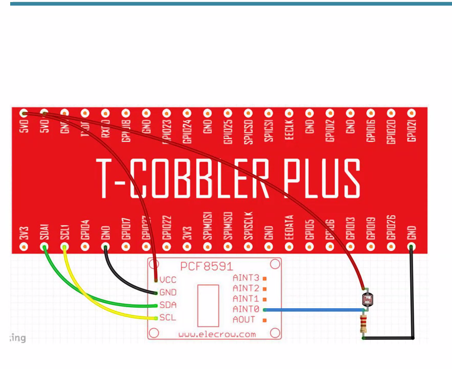
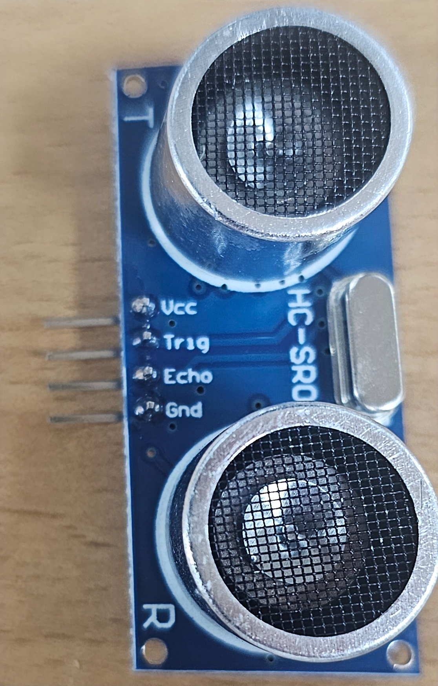
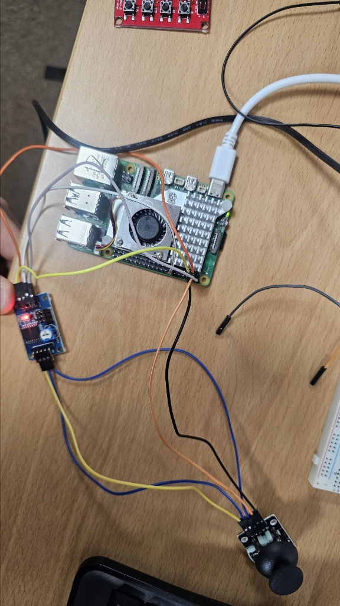
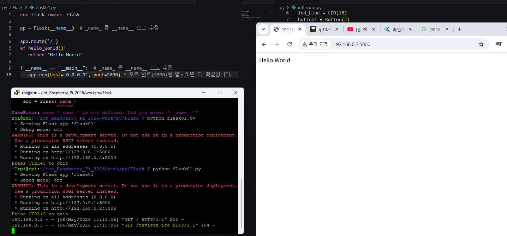
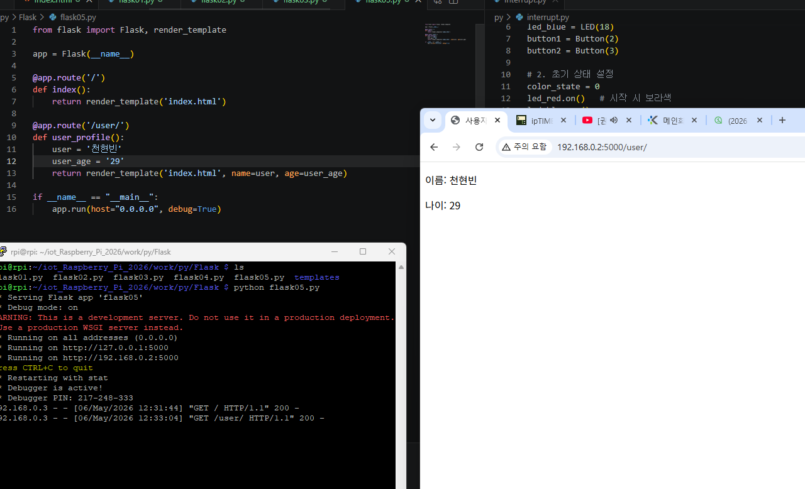
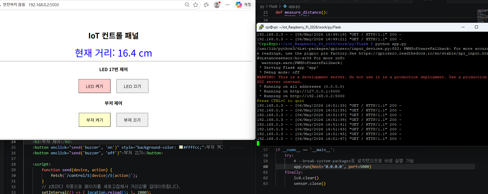

# iot_Raspberry_Pi_2026
2026년 Iot개발 라즈베리파이 리포지토리

# 🚗 IoT Raspberry Pi 2026 Project
라즈베리파이 5를 활용한 IoT 센서 제어 및 주차 보조 시스템 구현

- 공통 규칙 (이것부터 외우세요!)
VCC: 전원 플러스(+)입니다. 보통 빨간 선을 쓰고, 라즈베리 파이의 5V나 3.3V에 꽂습니다.

- GND (Ground): 전원 마이너스(-)입니다. 보통 검은 선을 쓰고, 라즈베리 파이의 GND라고 적힌 아무 곳에나 꽂으면 됩니다.

## 🛠 1. 개발 환경 (Setup)
- OS: Raspberry Pi OS (64-bit)
- Python 3.1x + venv
- Libraries: `gpiozero`, `lgpio`, `RPLCD`

## 📟 2. 주요 기능 (Features)
### [주차 보조 시스템 (car_sensor.py)]
- 초음파 센서를 이용한 실시간 거리 측정
- 거리에 따른 능동 부저 경고음 주기 조절
- LCD를 통한 거리 정보 시각화

### [수학 교육 도구 (multiplication_table.py)]
- I2C 1602 LCD를 활용한 구구단 출력 루틴

## 🔌 3. 회로도 및 원리 (Circuit)
- **풀업 저항(Pull-up Resistor)**: 스위치 입력 안정화를 위한 회로 설계


## 🚀 4. 시작하기 (How to Run)
1. 가상환경 활성화: `source .venv/bin/activate`
2. 실행: `python lcd_ultrasonic.py`

- 라즈베리파이 다운

- https://www.raspberrypi.com/software/


rpi

raspi


- https://www.realvnc.com/en/connect/download/viewer/


그다음 cmd 에서

ssh rpi@192.168.0.2
비번 입력후

```
sudo apt update
sudo apt apgrade를 한다.
```


아이디 비번 입력한다.


- 한글 설치


```
    1  sudo apt update
    2  sudo aup upgrade
    3  sudo apt upgrade
    4  sudo apt update
    5  sudo apt upgrade
    6  sudo raspi-config
    7  sudo apt install fonts-nanum fonts-nanum-extra
    8  sudo apt install fonts-unfonts-core
    9  sudo apt install ibus
   10  sudo apt install ibus-hangul
   11  ibus-setup
   12  ibus restart
   13  history
   14 sudo apt install libgpiod-dev gpiod -y
   15 uname -1
   16 uname -a
   17 ip a

    autoindent
    linenumbers
    tabsize3
```


- ls -l


- cat /etc/os-release


- uname


- free -h


## python 다운로드
```
81  ls
   82  cd work
   83  mkdir py
   84  ls
   85  cd py
   86  sudo apt install python3-libgpiod
   87  cd

```

## 가상환경

```
1. 가상환경 전용 폴더 만들고 들어가기
    mkdir -p ~/venvs
    cd ~/venvs
2. 가상환경 실제로 생성하기
    python3 -m venv venv
3. 가상환경 활성화(켜기)
    source venv/bin/activate
   source ./.venv/bin/activate

```

pinout

# iot_Raspberry_Pi_2026
2026년 Iot개발 라즈베리파이 리포지토리

- 라즈베리파이 다운

- https://www.raspberrypi.com/software/


rpi

raspi


- https://www.realvnc.com/en/connect/download/viewer/


그다음 cmd 에서

ssh rpi@192.168.0.2
비번 입력후

```
sudo apt update
sudo apt apgrade를 한다.
```


아이디 비번 입력한다.


- 한글 설치


```
    1  sudo apt update
    2  sudo aup upgrade
    3  sudo apt upgrade
    4  sudo apt update
    5  sudo apt upgrade
    6  sudo raspi-config
    7  sudo apt install fonts-nanum fonts-nanum-extra
    8  sudo apt install fonts-unfonts-core
    9  sudo apt install ibus
   10  sudo apt install ibus-hangul
   11  ibus-setup
   12  ibus restart
   13  history
   14 sudo apt install libgpiod-dev gpiod -y
   15 uname -1
   16 uname -a
   17 ip a

    autoindent
    linenumbers
    tabsize3
```


- ls -l


- cat /etc/os-release


- uname


- free -h


## python 다운로드
```
81  ls
   82  cd work
   83  mkdir py
   84  ls
   85  cd py
   86  sudo apt install python3-libgpiod
   87  cd

```

## 가상환경

```
1. 가상환경 전용 폴더 만들고 들어가기
    mkdir -p ~/venvs
    cd ~/venvs
2. 가상환경 실제로 생성하기
    python3 -m venv venv
3. 가상환경 활성화(켜기)
    source venv/bin/activate
   source ./.venv/bin/activate

```

pinout


```
1  sudo apt update
    2  sudo aup upgrade
    3  sudo apt upgrade
    4  sudo apt update
    5  sudo apt upgrade
    6  sudo raspi-config
    7  sudo apt install fonts-nanum fonts-nanum-extra
    8  sudo apt install fonts-unfonts-core
    9  sudo apt install ibus
   10  sudo apt install ibus-hangul
   11  ibus-setup
   12  ibus restart
   13  history
   14  sudo apt install libgpiod-dev gpiod -y
   15  sudo apy install libgpiod-dev gpiod -y
   16  sudo apt install libgpiod-dev gpiod -y
   17  ls
   18  pwd
   19  mdir -p work/c
   20  mkdir -p work/c
   21  ls
   22  mkdir -p wrk
   23  ls
   24  cd work
   25  ls
   26  cd c
   27  ls
   28  sudo nano/etc/nanorc
   29  sudo nano /etc/nanorc
   30  nano test.c
   31  sudo apt install fonts-nanum fonts-nanum-extra
   32  sudo apt install fonts-unfonts-core
   33  sudo apt intall ibus
   34  sudo apt install ibus
   35  sudo apt install ibus-hangul
   36  ibus-setup
   37  ibus-daemon -drx
   38  ibus-setup
   39  rpi
   40  ls
   41  cd work
   42  ls
   43  cd c
   44  ls
   45  gcc test.c -o test
   46  ls
   47  ./test
   48  sudo shutdown now
   49  history
   50  ls
   51  cd work
   52  ls
   53  nano /etc/nanorc
   54  sudo nano /etc/nanorc
   55  git config --global user.email "gusqls7748@://github.com"
   56  git config --global user.name "gusqls7748"
   57  git config pull.rebase false
   58  cd iot_Raspberry_Pi_2026
   59  git config pull.rebase false
   60  git pull origin main
   61  ㅣㄴ
   62  ls
   63  cd
   64  ls
   65  cd work
   66  ls
   67  cd
   68  ls
   69  cd iot_Raspberry_Pi_2026/
   70  ls
   71  cd work
   72  ls
   73  history
```

### 2일차

SWICH

- 

- 

1. 회로도 설명 (풀업 저항 원리)이미지 속 VCC(5V) -> 저항 -> GPIO2로 이어지는 붉은 화살표($i_1$)를 보세요.
스위치가 OFF일 때 (버튼 안 누름): 전기가 갈 곳이 없어서 저항을 지나 그대로 GPIO 2번 핀으로 들어갑니다. 
그래서 컴퓨터는 "아, 전기가 들어오네? HIGH(1) 상태구나"라고 인식합니다.
스위치가 ON일 때 (버튼 누름): 전기가 저항을 거친 후, 저항이 없는 아주 편한 길인 GND(0V) 쪽으로 쏟아져 내려갑니다. 
그러면 GPIO 2번 핀에는 전기가 거의 안 가게 되어 컴퓨터는 "LOW(0) 상태구나"라고 인식합니다.[!TIP]왜 저항을 쓰나요? 저항 없이 5V와 GND를 직접 연결하면 과전류가 흘러 라즈베리 파이가 망가질 수 있어요. 그래서 저항이 전기를 적당히 조절해주는 '댐' 역할을 하는 것입니다.

3. 하드웨어 연결 체크 (사진 6b1777.jpg 기준)
사진을 보니 주황색 선이 5V에, 보라색 선이 GPIO 2에, 초록색 선이 GND 쪽으로 가고 있는 것 같네요!

 1. 5V (주황색 선): 브레드보드의 저항 한쪽 끝으로 전기를 보내줍니다.
 2. 저항: 전기를 적당히 줄여서 버튼 다리와 GPIO 2번 선이 만나는 지점으로 보냅니다.
 3. GPIO 2 (보라색 선): 버튼과 저항 사이에서 전기가 오는지 감시합니다.
 4. GND (초록색 선): 버튼의 반대쪽 다리에 연결되어, 버튼을 누르는 순간 전기를 땅으로 흘려보냅니다

 

 ```
 sudo raspi-config
    pinout
    python3 -m venv .venv
    source .venv/bin/activate
    pip install gpiozero lgpio
    deactivate
    ls
    ls /dev/i2c*
    sudo apt install i2c-tools
    i2cdectect -y 1
    i2cdetect -y 1
    python -m venv --system-site-packages .venv
    source ./.venv/bin/activate
    ls
    i2cdetect -y 1
    sudo apt install i2c-tools
    i2cdetect -y 1
    history
 ```

 ### 3일차

 - VS Code 창에서 192.168.0.2
 1. 방법 1: 터미널에서 바로 접속 (가장 빠름)
- ssh rpi@192.168.0.2

- 방법 2: VS Code의 SSH 기능으로 연결 (추천)

1. 명령 팔레트 열기: 키보드에서 Ctrl + Shift + P를 누릅니다.

2. 명령어 입력: Remote-SSH: Connect to Host...를 타이핑하고 선택합니다.

3. 호스트 추가: + Add New SSH Host...를 클릭합니다.

4. 접속 정보 입력: ssh rpi@192.168.0.2를 입력하고 엔터를 누릅니다.

5. 구성 파일 선택: 가장 위에 나오는 설정 파일(.../.ssh/config)을 선택합니다.

6. 연결: 오른쪽 하단에 뜨는 [Connect] 버튼을 누르거나, 다시 Connect to Host...에서 192.168.0.2를 선택합니다.

7. 비밀번호 입력: 상단 중앙에 비밀번호 입력창이 뜨면 입력하세요.

```
(.venv) rpi@rpi:~/iot_Raspberry_Pi_2026/work/py $ i2cdetect -y 1
     0  1  2  3  4  5  6  7  8  9  a  b  c  d  e  f
00:                         -- -- -- -- -- -- -- -- 
10: -- -- -- -- -- -- -- -- -- -- -- -- -- -- -- -- 
20: -- -- -- -- -- -- -- -- -- -- -- -- -- -- -- -- 
30: -- -- -- -- -- -- -- -- -- -- -- -- -- -- -- -- 
40: -- -- -- -- -- -- -- -- 48 -- -- -- -- -- -- -- 
50: -- -- -- -- -- -- -- -- -- -- -- -- -- -- -- -- 
60: -- -- -- -- -- -- -- -- -- -- -- -- -- -- -- -- 
70: -- -- -- -- -- -- -- --                         
```




```
손으로 가렸을때 결과
(.venv) rpi@rpi:~/iot_Raspberry_Pi_2026/work/py $ python PCF8591.py 
CDS: 126
CDS: 126
CDS: 126
CDS: 126
CDS: 133
CDS: 167
CDS: 184
CDS: 183
CDS: 184
CDS: 170
CDS: 187
CDS: 187
CDS: 186
CDS: 185
^C종 료
```
- 센서
- bus.write_byte(ADDR, 0x40) # AIN1
- bus.write_byte(address, 0x42) 


- 능동 부저(Active Buzzer) (buzzer01.py,buzzer02.py, organ.py)
(+) 선 GPIO21에 연결 (-)GND(그라운드에 연결)


- 초음파센서(ultrasonic01.py,ultrasonic02.py,ultrasonic03.py)


- 초음파 센서와 능동 부저를 이용한 자동차 후방 센서 (car_sensor.py)
 

- I2C 1602 LCD 모듈 출력 (lcd.py, multiplication_table.py)
 

- 초음파 센서 값을 LCD에 표시 (lcd_ultrasonic.py)
 
 
## 4일차

- 모터(step01.py,step02.py,step03.py)
 

 - 일반 DC 모터와 달리 정밀한 각도 제어가 가능한 스테핑 모터의 동작 원리를 이해했습니다.

 - 모터에 전력을 공급하고, 회전 방향 및 속도를 제어하는 실습을 완료

 - 스위치를 이용한 모터 실행

 - 온습도 센서(dht11.py,temp_lcd.py)

 

 - 주변 환경의 온도와 습도 데이터를 디지털 신호로 읽어오는 실습

 - LCD를 이용해 화면에 출력가능하게 실습

- 4x4 키패드(keypad.py,Keypad_Lcd.py)


배열을 하여 키패트 입력 가능하게 한뒤

키패드에 입력하면 LCD에 출력 가능하도록 했다.

이 기능을 이용하여 도어락 시스템을 만들고 도어락 시스템에서 소리 나오도록 부저를 연결해 오디오 구현
맞으면 도레미가 나오도록 틀리면 삐삐삐 소리 나오도록 해서 했다.

### 5일차

- 조이스틱: 아날로그 입력을 통한 제어 로직 기반 마련



- 웹 서버 구축: 라즈베리 파이를 서버로 활용하여 외부 브라우저에서 접속 가능한 환경 제어.


- Web UI(HTML) 최적화: led.html을 통해 실시간 거리 데이터 시각화 및 LED/부저 원격 제어 버튼 구현.


- 초음파 센서를 이용해 거리를 측정하고, 측정된 데이터를 LCD와 웹 페이지에 실시간으로 출력하며 LED 및 부저를 제어하는 IoT 통합 시스템
    - 초음파 센서: 실시간 거리 측정 및 데이터 수집.
    - LCD(I2C): PCF8574 모듈을 사용하여 0x27 주소로 측정 거리 실시간 출력.
    - 웹 명령에 따른 LED(GPIO 17) 및 부저(GPIO 18) On/Off 작동

- 결과: 켜기 버튼을 누르면 작동하고 끄기 버튼을 누르면 꺼진다.
    초음파 센서로 측량하면 웹이랑 LCD에서 거리 값이 뜨는 시스템이다.


```
1. 부저 (Buzzer)
부저는 전극이 있어서 방향이 중요합니다.

긴 다리 (+): GPIO 18번 핀에 꽂습니다.

짧은 다리 (-): 라즈베리 파이의 GND 핀에 꽂습니다.

팁: 만약 다리 길이가 같다면 윗면의 (+) 표시를 확인하세요.

2. 초음파 센서 (HC-SR04)
핀이 4개라 조금 복잡해 보이지만 역할이 확실합니다.

VCC: 5V 핀 (거리를 정확히 재려면 힘이 좋은 5V가 필요합니다).

Trig: GPIO 23번 (신호를 보내는 '입' 역할).

Echo: GPIO 24번 (돌아오는 신호를 듣는 '귀' 역할).

GND: GND 핀.

3. LCD (I2C 모듈 부착형)
뒷면에 배낭처럼 보드가 붙어있어 핀 4개로 통신합니다.

GND: GND 핀.

VCC: 5V 핀 (3.3V에 꽂으면 화면이 너무 흐려서 안 보일 수 있습니다).

SDA: GPIO 2번 (데이터가 왔다 갔다 하는 길).

SCL: GPIO 3번 (데이터 박자를 맞추는 길).

4. LED
긴 다리 (+): GPIO 17번 (제어용 핀).

짧은 다리 (-): GND 핀.


```