# iot_Raspberry_Pi_2026
2026년 Iot개발 라즈베리파이 리포지토리

- 라즈베리파이 다운

- https://www.raspberrypi.com/software/

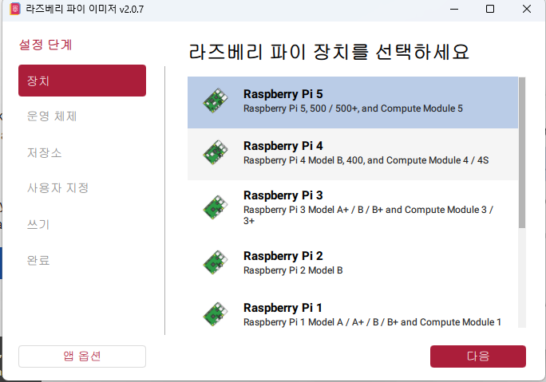

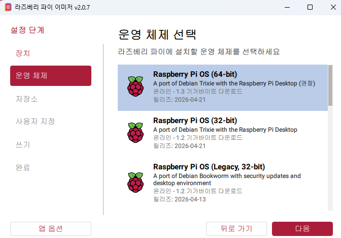


rpi

raspi

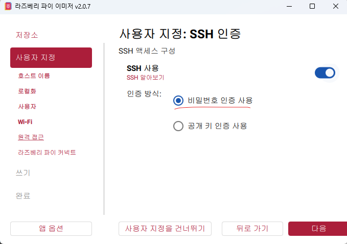


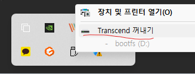

- https://www.realvnc.com/en/connect/download/viewer/


그다음 cmd 에서

ssh rpi@192.168.0.2
비번 입력후

```
sudo apt update
sudo apt apgrade를 한다.
```

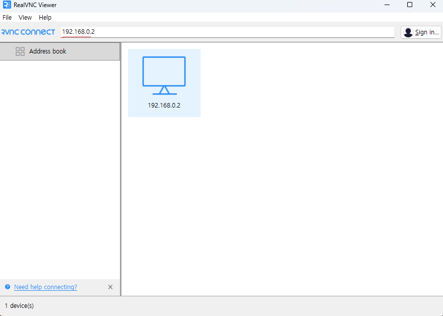

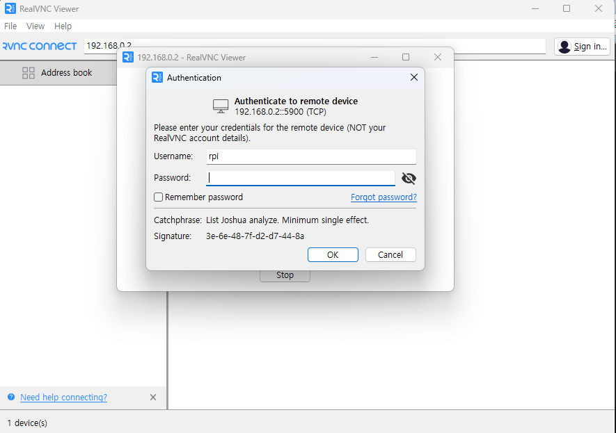

아이디 비번 입력한다.

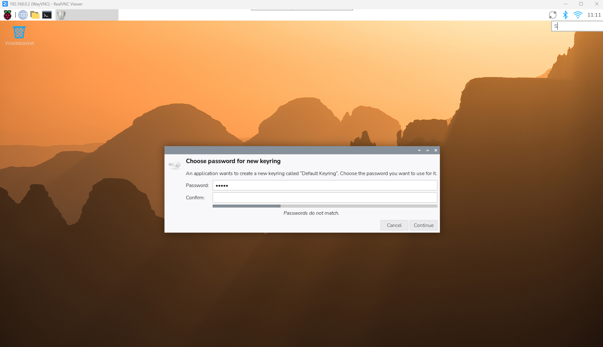

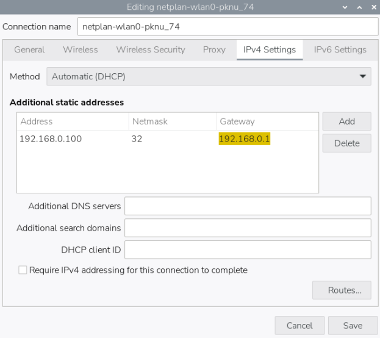

- 한글 설치
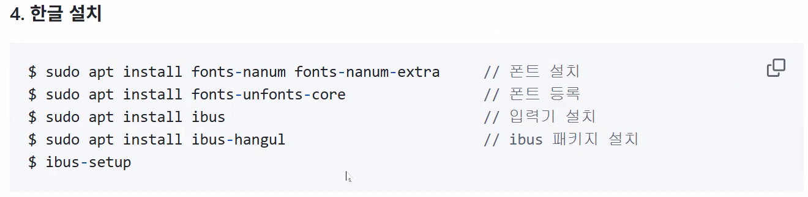

```
    1  sudo apt update
    2  sudo aup upgrade
    3  sudo apt upgrade
    4  sudo apt update
    5  sudo apt upgrade
    6  sudo raspi-config
    7  sudo apt install fonts-nanum fonts-nanum-extra
    8  sudo apt install fonts-unfonts-core
    9  sudo apt install ibus
   10  sudo apt install ibus-hangul
   11  ibus-setup
   12  ibus restart
   13  history
   14 sudo apt install libgpiod-dev gpiod -y
   15 uname -1
   16 uname -a
   17 ip a

    autoindent
    linenumbers
    tabsize3
```

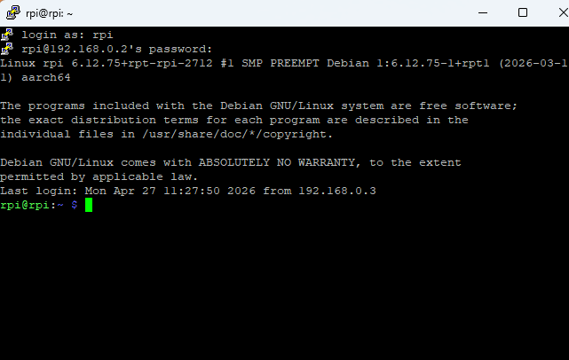

- ls -l
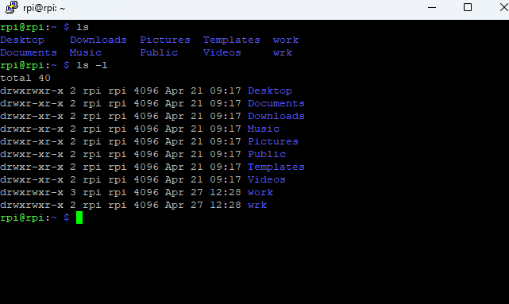

- cat /etc/os-release
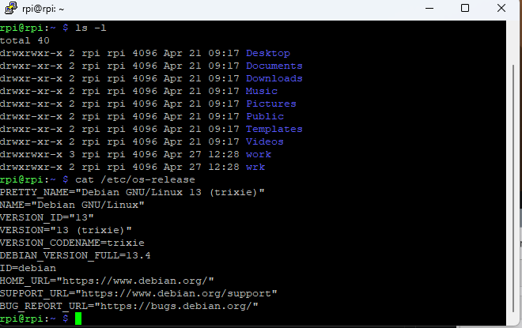

- uname
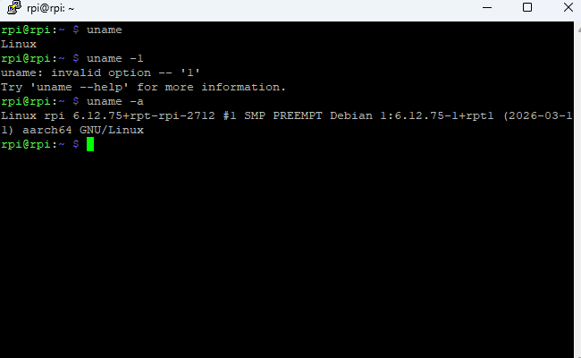

- free -h
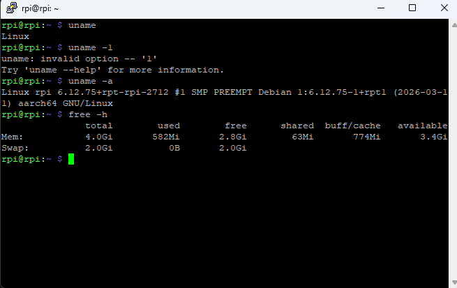

## python 다운로드
```
81  ls
   82  cd work
   83  mkdir py
   84  ls
   85  cd py
   86  sudo apt install python3-libgpiod
   87  cd

```

## 가상환경

```
1. 가상환경 전용 폴더 만들고 들어가기
    mkdir -p ~/venvs
    cd ~/venvs
2. 가상환경 실제로 생성하기
    python3 -m venv venv
3. 가상환경 활성화(켜기)
    source venv/bin/activate
   source ./.venv/bin/activate

```

pinout

# iot_Raspberry_Pi_2026
2026년 Iot개발 라즈베리파이 리포지토리

- 라즈베리파이 다운

- https://www.raspberrypi.com/software/


rpi

raspi


- https://www.realvnc.com/en/connect/download/viewer/


그다음 cmd 에서

ssh rpi@192.168.0.2
비번 입력후

```
sudo apt update
sudo apt apgrade를 한다.
```


아이디 비번 입력한다.


- 한글 설치


```
    1  sudo apt update
    2  sudo aup upgrade
    3  sudo apt upgrade
    4  sudo apt update
    5  sudo apt upgrade
    6  sudo raspi-config
    7  sudo apt install fonts-nanum fonts-nanum-extra
    8  sudo apt install fonts-unfonts-core
    9  sudo apt install ibus
   10  sudo apt install ibus-hangul
   11  ibus-setup
   12  ibus restart
   13  history
   14 sudo apt install libgpiod-dev gpiod -y
   15 uname -1
   16 uname -a
   17 ip a

    autoindent
    linenumbers
    tabsize3
```


- ls -l


- cat /etc/os-release


- uname


- free -h


## python 다운로드
```
81  ls
   82  cd work
   83  mkdir py
   84  ls
   85  cd py
   86  sudo apt install python3-libgpiod
   87  cd

```

## 가상환경

```
1. 가상환경 전용 폴더 만들고 들어가기
    mkdir -p ~/venvs
    cd ~/venvs
2. 가상환경 실제로 생성하기
    python3 -m venv venv
3. 가상환경 활성화(켜기)
    source venv/bin/activate
   source ./.venv/bin/activate

```

pinout

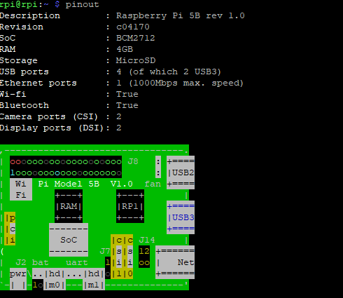

```
1  sudo apt update
    2  sudo aup upgrade
    3  sudo apt upgrade
    4  sudo apt update
    5  sudo apt upgrade
    6  sudo raspi-config
    7  sudo apt install fonts-nanum fonts-nanum-extra
    8  sudo apt install fonts-unfonts-core
    9  sudo apt install ibus
   10  sudo apt install ibus-hangul
   11  ibus-setup
   12  ibus restart
   13  history
   14  sudo apt install libgpiod-dev gpiod -y
   15  sudo apy install libgpiod-dev gpiod -y
   16  sudo apt install libgpiod-dev gpiod -y
   17  ls
   18  pwd
   19  mdir -p work/c
   20  mkdir -p work/c
   21  ls
   22  mkdir -p wrk
   23  ls
   24  cd work
   25  ls
   26  cd c
   27  ls
   28  sudo nano/etc/nanorc
   29  sudo nano /etc/nanorc
   30  nano test.c
   31  sudo apt install fonts-nanum fonts-nanum-extra
   32  sudo apt install fonts-unfonts-core
   33  sudo apt intall ibus
   34  sudo apt install ibus
   35  sudo apt install ibus-hangul
   36  ibus-setup
   37  ibus-daemon -drx
   38  ibus-setup
   39  rpi
   40  ls
   41  cd work
   42  ls
   43  cd c
   44  ls
   45  gcc test.c -o test
   46  ls
   47  ./test
   48  sudo shutdown now
   49  history
   50  ls
   51  cd work
   52  ls
   53  nano /etc/nanorc
   54  sudo nano /etc/nanorc
   55  git config --global user.email "gusqls7748@://github.com"
   56  git config --global user.name "gusqls7748"
   57  git config pull.rebase false
   58  cd iot_Raspberry_Pi_2026
   59  git config pull.rebase false
   60  git pull origin main
   61  ㅣㄴ
   62  ls
   63  cd
   64  ls
   65  cd work
   66  ls
   67  cd
   68  ls
   69  cd iot_Raspberry_Pi_2026/
   70  ls
   71  cd work
   72  ls
   73  history
```

### 2일차

SWICH

- 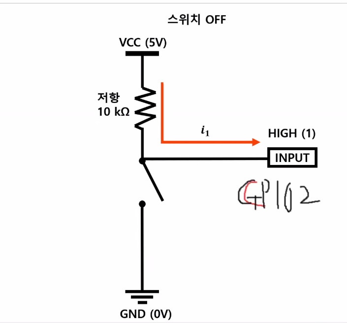

- 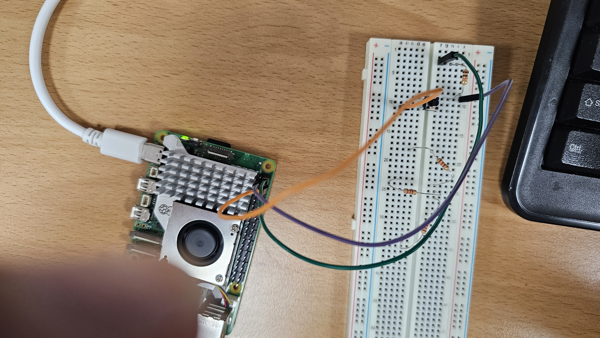

1. 회로도 설명 (풀업 저항 원리)이미지 속 VCC(5V) -> 저항 -> GPIO2로 이어지는 붉은 화살표($i_1$)를 보세요.
스위치가 OFF일 때 (버튼 안 누름): 전기가 갈 곳이 없어서 저항을 지나 그대로 GPIO 2번 핀으로 들어갑니다. 
그래서 컴퓨터는 "아, 전기가 들어오네? HIGH(1) 상태구나"라고 인식합니다.
스위치가 ON일 때 (버튼 누름): 전기가 저항을 거친 후, 저항이 없는 아주 편한 길인 GND(0V) 쪽으로 쏟아져 내려갑니다. 
그러면 GPIO 2번 핀에는 전기가 거의 안 가게 되어 컴퓨터는 "LOW(0) 상태구나"라고 인식합니다.[!TIP]왜 저항을 쓰나요? 저항 없이 5V와 GND를 직접 연결하면 과전류가 흘러 라즈베리 파이가 망가질 수 있어요. 그래서 저항이 전기를 적당히 조절해주는 '댐' 역할을 하는 것입니다.

3. 하드웨어 연결 체크 (사진 6b1777.jpg 기준)
사진을 보니 주황색 선이 5V에, 보라색 선이 GPIO 2에, 초록색 선이 GND 쪽으로 가고 있는 것 같네요!

 1. 5V (주황색 선): 브레드보드의 저항 한쪽 끝으로 전기를 보내줍니다.
 2. 저항: 전기를 적당히 줄여서 버튼 다리와 GPIO 2번 선이 만나는 지점으로 보냅니다.
 3. GPIO 2 (보라색 선): 버튼과 저항 사이에서 전기가 오는지 감시합니다.
 4. GND (초록색 선): 버튼의 반대쪽 다리에 연결되어, 버튼을 누르는 순간 전기를 땅으로 흘려보냅니다

 

 ```
 sudo raspi-config
    pinout
    python3 -m venv .venv
    source .venv/bin/activate
    pip install gpiozero lgpio
    deactivate
    ls
    ls /dev/i2c*
    sudo apt install i2c-tools
    i2cdectect -y 1
    i2cdetect -y 1
    python -m venv --system-site-packages .venv
    source ./.venv/bin/activate
    ls
    i2cdetect -y 1
    sudo apt install i2c-tools
    i2cdetect -y 1
    history
 ```